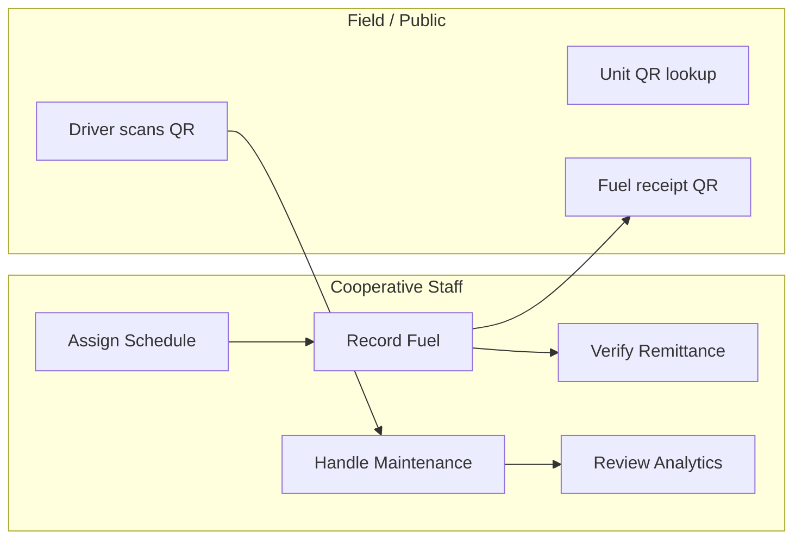
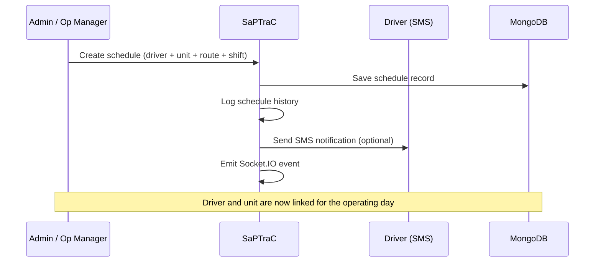
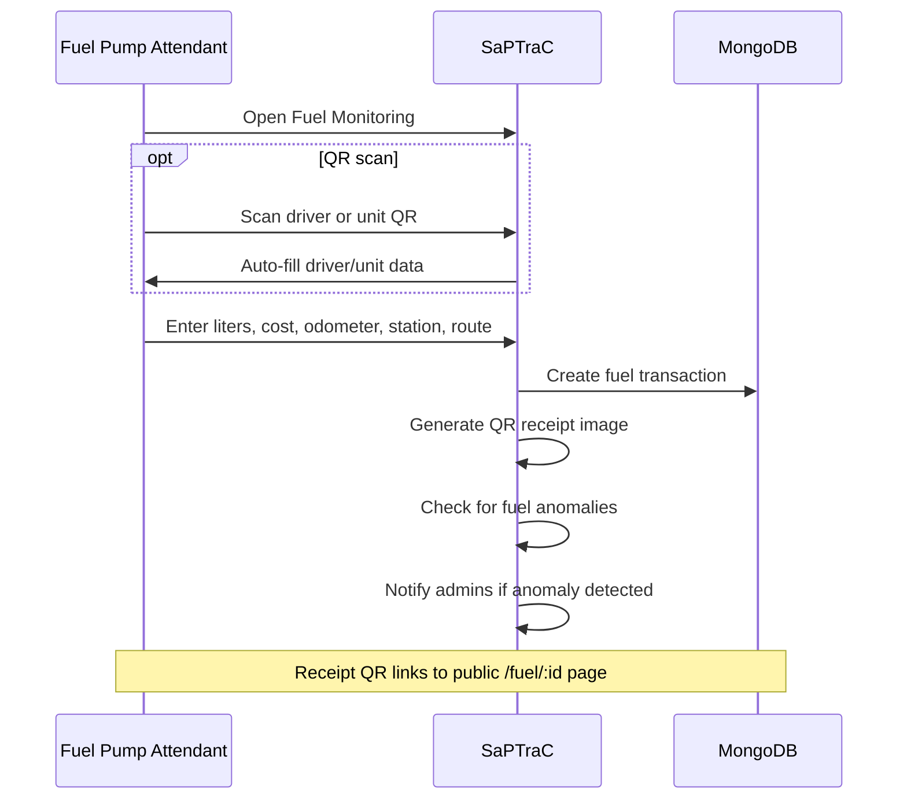
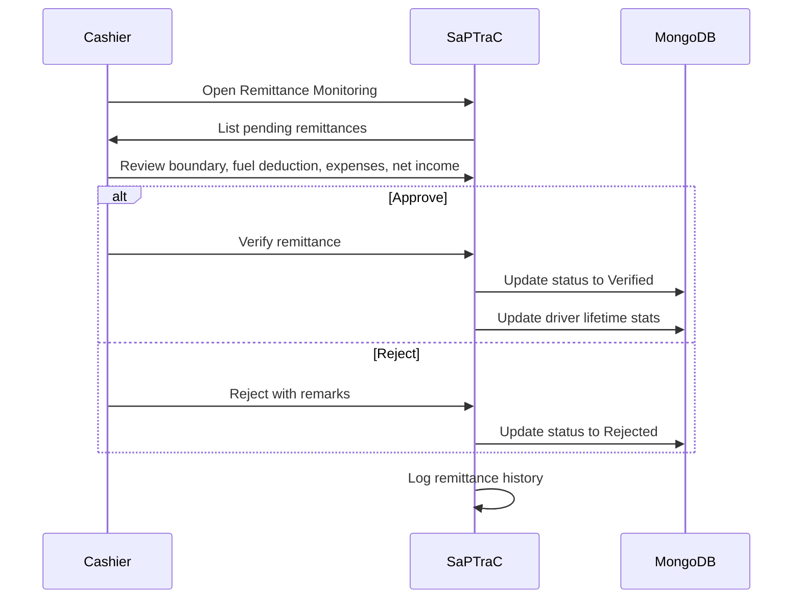
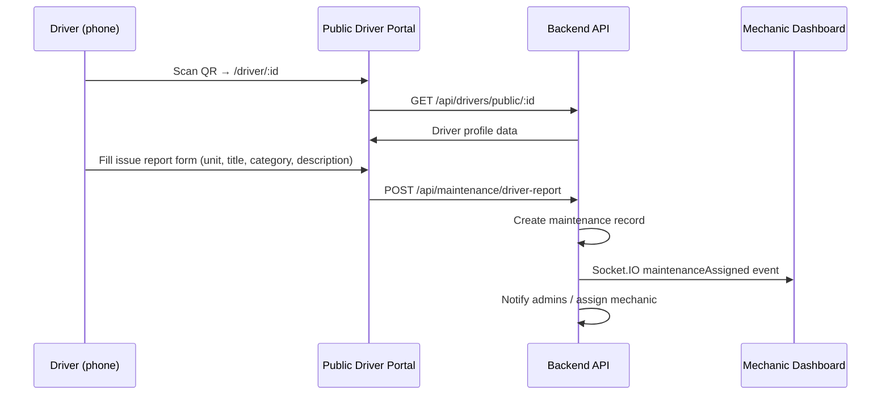
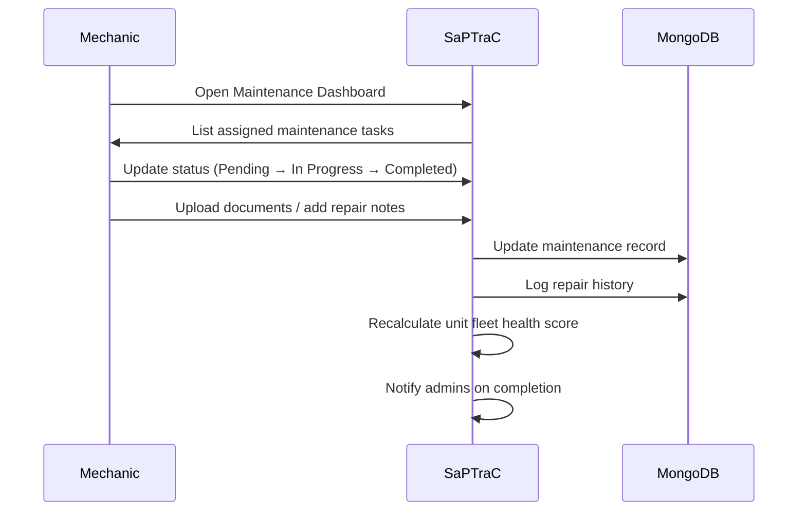
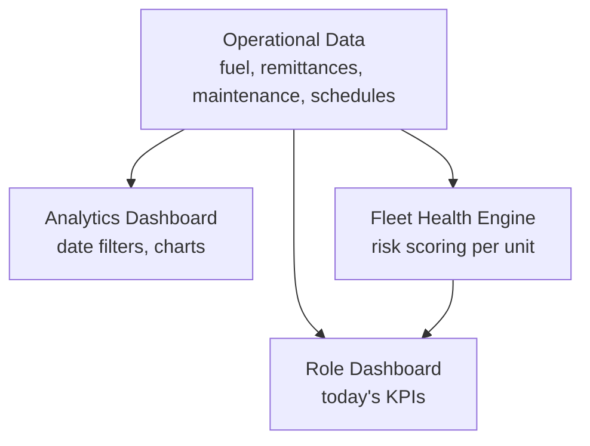
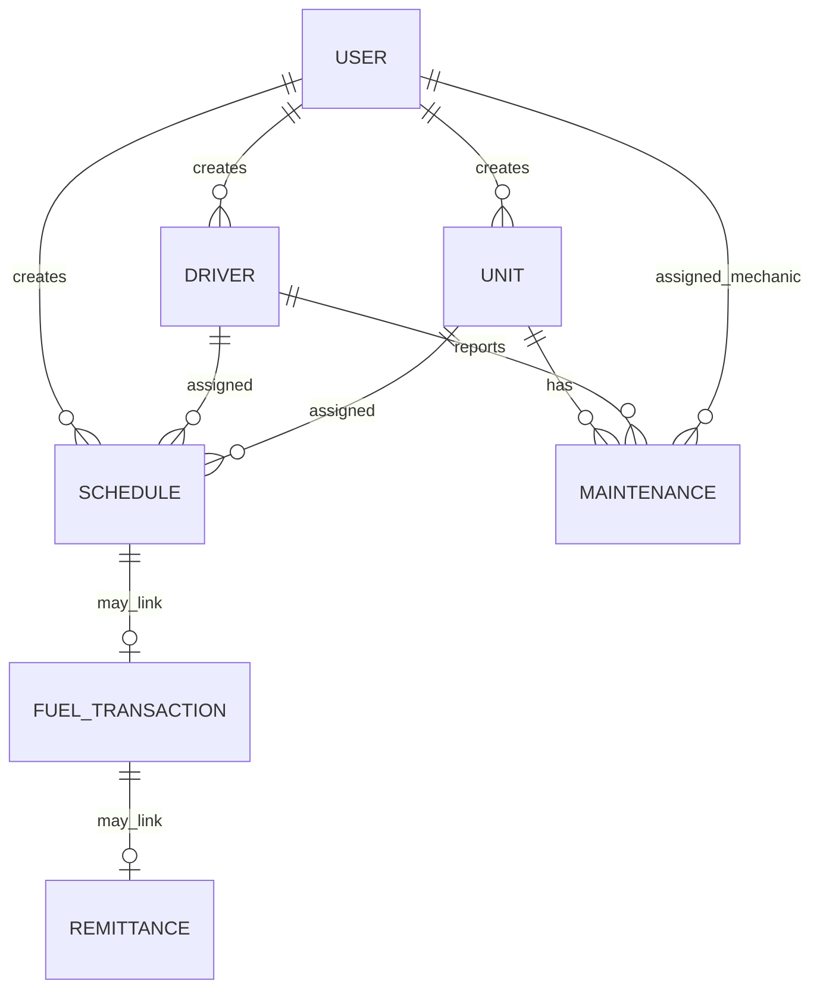

# SaPTraC — In-Depth System Review

**SaPTraC** (*Sistema ng Pamamahala sa Transportasyon at Kooperatiba*) is a fleet and cooperative operations platform built for **San Pedro Transport Cooperative (SPTC)**. Despite living under `XAMPP/htdocs`, it is **not** a PHP/XAMPP application — it is a modern **React + Node.js + MongoDB** system for running day-to-day transport cooperative business.

| Layer | Technology |
|-------|------------|
| Frontend | React 19, Vite 8, Tailwind CSS, DaisyUI, Recharts, React Big Calendar |
| Backend | Node.js, Express 5, Socket.IO |
| Database | MongoDB (Mongoose) — database name: `notes_db` |
| Auth | JWT + bcrypt |
| Extras | Upstash Redis (rate limiting), QR codes, file uploads, optional Android SMS gateway |

**Default ports:** Frontend `5173` · Backend `3000`

---

## Table of Contents

1. [What the System Is Supposed to Do](#what-the-system-is-supposed-to-do)
2. [Who It Is For](#who-it-is-for)
3. [Core Workflows](#core-workflows)
4. [Architecture Overview](#architecture-overview)
5. [Strengths](#strengths)
6. [Gaps and Rough Edges](#gaps-and-rough-edges)
7. [Weaknesses](#weaknesses)
8. [Improvements and New Feature Ideas](#improvements-and-new-feature-ideas)
9. [What Success Looks Like](#what-success-looks-like)
10. [Bottom Line](#bottom-line)

---

## What the System Is Supposed to Do

At its core, SaPTraC is an **operational command center** for a jeepney/PUV-style transport cooperative. It connects the full daily operating loop: assign drivers and units, record fuel, verify remittances, track maintenance, and report on cooperative finances and fleet health.

### 1. Fleet Registry

- **Drivers** — profiles, licenses, emergency contacts, documents, lifetime stats (remittance, fuel, trips).
- **Units** — vehicles with plate/body numbers, route assignment, availability and maintenance status.
- Each driver and unit receives a **QR code** linking to a public information page.

### 2. Scheduling

- Assigns **driver + unit + route + shift** (First Shift / Second Shift).
- Maintains schedule history and sends notifications.
- Can trigger **SMS** (via a local Android SMS gateway) when schedules change.

### 3. Fuel Operations

- Records diesel purchases: liters, cost, odometer in/out, station, shift, route.
- Tracks cooperative-specific trip types: **pila trips** and **salubong trips**.
- Generates **QR-coded fuel receipts** (per transaction and daily summaries).
- Fuel pump attendants can use **QR scanning** to identify drivers/units quickly.

### 4. Remittance / Cashier Workflow

- Tracks how much drivers owe the cooperative after a shift.
- Fields like **boundary**, fuel deduction, salary deduction, cooperative income, driver net income, and negative balance reflect real cooperative accounting.
- Cashiers **verify** remittances (Pending → Verified / Rejected).
- Routes are fixed to cooperative lines: Langgam, Villarosa, Bayan-Bayanan, Estrella, Calamba.

### 5. Maintenance

- Drivers can **report vehicle issues** from the public driver portal (no login required).
- Mechanics receive a real-time dashboard (Socket.IO) for assigned work.
- Includes a **decision support / fleet health** layer that scores units by maintenance history, recurring issues, emergency repairs, and cost trends.

### 6. Analytics and Oversight

- Dashboard with today's revenue, transactions, fuel cost, active drivers/units, and maintenance incidents.
- Deeper analytics: revenue by route, top drivers, fleet status, date-range filtering.
- Fleet health overview with risk levels (Healthy → Critical).

### 7. User and Access Control

- JWT-based login with **role-based menus** so each staff member only sees what they need.

---

## Who It Is For

| User | How They Access | Primary Job in the System |
|------|-----------------|---------------------------|
| **Super Admin / Administrator** | Login | Full control: users, drivers, units, schedules, fuel, remittances, maintenance, analytics |
| **Operational Manager** | Login | Day-to-day ops: drivers, units, schedules, analytics |
| **Cashier** | Login | Dashboard + **remittance verification** |
| **Fuel Pump Attendant** | Login | Dashboard + **fuel monitoring** + scheduling visibility |
| **Mechanic** | Login | Dashboard + **maintenance queue** with live updates |
| **Drivers** | **QR code** (no account) | View profile, report vehicle issues to maintenance |
| **Public / auditors** | QR on unit or fuel receipt | View unit health/history or verify fuel transactions |

**Important distinction:** Drivers are **not** system users with passwords. They interact through **mobile-friendly public pages** opened by scanning a QR code — a practical design for field staff who may not have cooperative login credentials.

### Role-Based Menu Access

| Module | Super Admin | Admin | Op. Manager | Cashier | Pump Attendant | Mechanic |
|--------|:-----------:|:-----:|:-----------:|:-------:|:--------------:|:--------:|
| Dashboard | ✓ | ✓ | ✓ | ✓ | ✓ | ✓ |
| User Management | ✓ | ✓ | | | | |
| Drivers | ✓ | ✓ | ✓ | | | |
| Units | ✓ | ✓ | ✓ | | | |
| Scheduling | ✓ | ✓ | ✓ | | ✓ | |
| Fuel Monitoring | ✓ | ✓ | | | ✓ | |
| Remittances | ✓ | ✓ | | ✓ | | |
| Maintenance | ✓ | ✓ | | | | ✓ |
| Analytics | ✓ | ✓ | ✓ | | | |

---

## Core Workflows

### High-Level Operating Loop

### Workflow 1 — Daily Shift Setup (Scheduling)

**Steps:**

1. Admin or Operational Manager opens **Scheduling**.
2. Selects driver, unit, route, and shift.
3. System saves the schedule and logs history.
4. Optional SMS is sent to the driver via Android SMS gateway.
5. Schedule appears on the scheduling board for staff visibility.

---

### Workflow 2 — Fuel Transaction

**Steps:**

1. Fuel Pump Attendant records a fuel purchase (manually or via QR scan).
2. System stores transaction with route, shift, odometer readings, and trip counts.
3. A QR-coded receipt is generated and stored.
4. Admins may be notified if an anomaly is detected (e.g., unusual consumption).
5. Transaction can later be linked to a remittance record.

---

### Workflow 3 — Remittance Verification (Cashier)

**Steps:**

1. Cashier reviews remittance records (often linked to a fuel transaction).
2. Checks boundary, deductions, cooperative income, and driver net income.
3. Flags **negative balance** cases for follow-up.
4. Verifies or rejects the remittance.
5. System updates driver lifetime statistics and audit history.

---

### Workflow 4 — Driver Reports Issue (Public QR Portal)

**Steps:**

1. Driver scans their QR code on a phone (same Wi-Fi or public URL).
2. Public portal loads driver profile without login.
3. Driver selects a unit and describes the vehicle issue.
4. System creates a maintenance request.
5. Mechanics and admins receive real-time notifications.

---

### Workflow 5 — Maintenance Resolution (Mechanic)

**Steps:**

1. Mechanic sees assigned issues in real time via Socket.IO.
2. Updates status and uploads supporting documents.
3. System logs repair history for audit.
4. Fleet health scoring is recalculated for the affected unit.
5. Admins are notified when critical issues are resolved.

---

### Workflow 6 — Management Analytics

**Steps:**

1. Leadership opens the dashboard for today's snapshot (revenue, fuel, active fleet).
2. Analytics page provides deeper charts: revenue by route, top drivers, trends.
3. Fleet health engine recommends which units need attention.
4. Dashboard auto-refreshes every 10 seconds for near-real-time ops view.

---

### Data Relationship Chain

---

## Architecture Overview

### Frontend Routes

| Path | Access | Purpose |
|------|--------|---------|
| `/`, `/login` | Public | Staff login |
| `/dashboard` | Protected | Role-based overview |
| `/users` | Protected | User management |
| `/drivers` | Protected | Driver CRUD + QR management |
| `/units` | Protected | Unit CRUD + QR management |
| `/schedules` | Protected | Scheduling board |
| `/fuel` | Protected | Fuel monitoring + QR scanner |
| `/remittances` | Protected | Remittance verification |
| `/maintenance` | Protected | Maintenance dashboard |
| `/analytics` | Protected | Charts and KPIs |
| `/driver/:id` | Public | Driver portal (QR) |
| `/unit/:id` | Public | Unit portal (QR) |
| `/fuel/:id` | Public | Fuel receipt (QR) |
| `/fuel/daily-receipt/:dateKey` | Public | Daily fuel summary |

### Backend API Modules

| Prefix | Purpose |
|--------|---------|
| `/api/auth` | Login, register, logout |
| `/api/users` | User management |
| `/api/drivers` | Driver CRUD + public dashboard |
| `/api/units` | Vehicle/unit management |
| `/api/schedules` | Scheduling |
| `/api/fuel` | Fuel transactions, receipts, QR |
| `/api/remittances` | Remittance tracking |
| `/api/maintenance` | Maintenance requests |
| `/api/analytics` | Dashboard analytics |
| `/api/repair-history` | Repair audit trail |
| `/api/notes` | Notes (legacy scaffold) |
| `/api/revenue` | Revenue data |

### MongoDB Collections (12)

| Collection | Purpose |
|------------|---------|
| `users` | System accounts and roles |
| `drivers` | Driver profiles, licenses, QR codes |
| `units` | Vehicles/units |
| `schedules` | Driver-unit scheduling |
| `fueltransactions` | Fuel purchases and receipts |
| `remittances` | Driver remittances |
| `maintenances` | Maintenance requests |
| `notifications` | In-app notifications |
| `schedulehistories` | Schedule change audit trail |
| `remittancehistories` | Remittance change audit trail |
| `repairhistories` | Repair audit trail |
| `notes` | Standalone notes (legacy) |

---

## Strengths

### Domain Fit

- Built specifically for **Philippine transport cooperatives**, not generic fleet software.
- Uses real cooperative concepts: boundary, pila/salubong trips, route-based remittance, cooperative income.
- Currency, routes, and branding align with **San Pedro Transport Cooperative**.

### Practical Field Design

- **QR-first driver access** — no passwords required for drivers in the field.
- Mobile-friendly public portals for driver info and issue reporting.
- QR scanning at the fuel station speeds up data entry for pump attendants.

### Role Separation

- Sidebar and permissions filter features per role (cashier sees remittances, mechanic sees maintenance, etc.).
- Reduces clutter and training burden for non-technical staff.

### Operational Intelligence

- Fleet health scoring and maintenance decision support go beyond simple CRUD.
- Anomaly detection on fuel transactions.
- Lifetime driver/unit statistics for long-term tracking.
- Auto-refreshing dashboard for live operations view.

### Audit and Accountability

- History models for schedules, remittances, and repairs.
- Soft deletes preserve data integrity.
- Verification workflow for remittances (Pending / Verified / Rejected).

### Modern, Maintainable Stack

- React SPA + REST API is standard and deployable.
- Socket.IO for real-time maintenance and notifications.
- Vite for fast development; Tailwind/DaisyUI for consistent UI.

### Extensibility

- Optional SMS gateway integration for schedule alerts.
- File upload support for driver documents and maintenance records.
- Analytics layer can grow with more reports and exports.

---

## Gaps and Rough Edges

### Configuration Fragility

- Project was originally developed on LAN IP `192.168.68.105`; several URLs and QR codes depend on `FRONTEND_URL` and `VITE_*` env vars.
- QR codes are **baked into MongoDB** at creation time — changing IP/domain requires regeneration.
- Phone access requires same Wi-Fi or a tunnel; LAN URLs do not work on mobile data.

### Prototype Leftovers

- `CreatePage.jsx`, `NoteDetailPage.jsx`, and `/api/notes` appear to be from an early "notes app" scaffold.
- MongoDB database is named `notes_db` while the app is a transport cooperative system.
- These leftovers can confuse new developers about the project's true scope.

### Inconsistent Public vs Protected APIs

- `UnitDashboard` calls some endpoints with a Bearer token from `localStorage`, which public QR visitors won't have.
- Public pages may show partial data or fail silently for unauthenticated users.

### Hardcoded Values

- Routes (Langgam, Villarosa, etc.) are enums in the database — adding a route requires code changes.
- Some components still had hardcoded IP fallbacks (being cleaned up incrementally).

### QR and Receipt Staleness

- Fuel transaction `qrCodeData` in existing records may still point to old URLs until regenerated.
- No admin UI button to "regenerate all QR codes" — requires a script.

### Documentation vs Reality

- System architecture diagram notes some routes as "defined but not mounted" — may be outdated since `server.js` now mounts all resource routes.
- SETUP.md hardcoded IP checklist needs ongoing maintenance as env-based config improves.

### DevOps Gaps

- No Docker, CI/CD, or automated deployment pipeline in the repo.
- Windows firewall must be configured manually for LAN phone testing.
- Production story is "build frontend + run Node" without a bundled guide for HTTPS/domain setup.

---

## Weaknesses

### Security

- Public driver/unit/fuel pages expose IDs in URLs — predictable if IDs are guessable (MongoDB ObjectIds).
- No rate limiting visibly applied on all public endpoints (global limiter is commented out in `server.js`).
- JWT stored in `localStorage` (standard but vulnerable to XSS).
- `.env` files can contain secrets; no secrets management for production.
- MongoDB Atlas network access and credential handling depend on manual setup.

### Scalability

- File uploads stored on local disk (`backend/uploads/`) — not suitable for multi-server deployment without shared storage.
- Socket.IO on a single Node process — horizontal scaling requires a Redis adapter.
- No caching layer for heavy analytics queries beyond Upstash rate limiting.

### Reliability

- SMS depends on a **local Android device** on the LAN — single point of failure.
- If Upstash Redis is down, rate limiting may fail depending on configuration.
- No offline/PWA support for drivers in areas with poor connectivity.

### User Experience

- Drivers have no login — they cannot see their own remittance history or schedule on the portal.
- Mechanic has a separate `MechanicDashboard.jsx` but routing sends all roles to the same `/dashboard` first.
- Error messages on public portals can be generic ("Loading..." forever if API fails).
- No multi-language support (Filipino/English toggle would help field staff).

### Testing and Quality

- No visible automated test suite (unit, integration, or E2E).
- Large page components (e.g., `FuelMonitoringPage.jsx`, `AnalyticsDashboard.jsx`) are hard to maintain and test.
- Console.log debugging statements remain in production code paths.

### Data Model

- `notes` collection and cooperative data share one database with a misleading name.
- Some schema field naming inconsistencies (e.g., `emergencyContact.relation` vs UI expecting `relationship`).
- Fuel and remittance linking is optional — orphaned records possible if workflow is skipped.

---

## Improvements and New Feature Ideas

### Infrastructure and DevOps

| Improvement | Benefit |
|-------------|---------|
| Docker Compose (frontend + backend + optional Redis) | One-command local and staging setup |
| Environment-based config with no hardcoded IPs | Reliable QR and mobile access |
| Admin "Regenerate QR Codes" button | No manual script needed after IP/domain change |
| HTTPS + reverse proxy guide (nginx/Apache) | Production-ready deployment |
| CI/CD pipeline (GitHub Actions) | Automated lint, test, build |
| Cloud file storage (S3, Cloudinary) | Scalable document and image uploads |

### Security Hardening

| Improvement | Benefit |
|-------------|---------|
| Signed/expiring tokens for public QR URLs (`?secret=...`) | Prevents unauthorized access to driver profiles |
| Enable and tune rate limiting on public endpoints | Reduces abuse and scraping |
| HttpOnly cookie-based JWT | Reduces XSS token theft risk |
| Role-based API tests | Catch permission regressions |
| Audit log for all admin actions | Compliance and dispute resolution |

### Driver-Facing Features

| Feature | Description |
|---------|-------------|
| Driver PIN or OTP login | Let drivers see remittance history and schedule without full staff account |
| Push notifications (SMS already partial) | Schedule changes, remittance verified, maintenance updates |
| Remittance summary on driver portal | Transparency for cooperative members |
| Digital ID card | QR shows photo, license expiry, active/suspended status prominently |
| Offline issue report queue | Submit maintenance reports when connectivity returns |

### Operations Features

| Feature | Description |
|---------|-------------|
| Route management UI | Add/edit routes without code changes |
| Bulk schedule creation | Copy weekly templates |
| Shift handover checklist | Odometer, fuel level, damage notes at shift change |
| Negative balance alerts | Auto-notify cashier and driver when balance goes negative |
| Printable daily summary | End-of-day report for cooperative officers |
| Excel/PDF export | Analytics, remittances, fuel logs for accounting |

### Fuel and Remittance

| Feature | Description |
|---------|-------------|
| Fuel price per liter tracking | Better cost analysis over time |
| Automatic remittance calculation | Pre-fill from fuel transaction + boundary rules |
| Receipt reprint with updated QR | Fix stale receipt URLs from admin UI |
| Fuel anomaly dashboard | Dedicated view for suspicious consumption patterns |
| Integration with station POS | Reduce manual entry at pump |

### Maintenance and Fleet

| Feature | Description |
|---------|-------------|
| Preventive maintenance schedule | Oil change, tire rotation reminders by odometer/date |
| Parts inventory | Track spare parts used per repair |
| Vendor/garage management | External repair shop tracking |
| Unit downtime tracker | Days out of service affects revenue reporting |
| Maintenance cost budgeting | Forecast monthly maintenance spend |

### Analytics and Reporting

| Feature | Description |
|---------|-------------|
| Monthly cooperative board report | Auto-generated PDF for leadership meetings |
| Driver performance ranking | Revenue, fuel efficiency, incident rate |
| Route profitability analysis | Which routes generate most cooperative income |
| Year-over-year comparisons | Seasonal trend visibility |
| Custom date presets | "This week", "Last month", "Quarter" quick filters |

### UX and Accessibility

| Feature | Description |
|---------|-------------|
| Filipino language toggle | Better adoption for drivers and staff |
| Role-specific landing pages | Mechanic goes straight to maintenance, cashier to remittances |
| Mobile-responsive admin (priority pages) | Fuel and remittance on tablet at counter |
| Global error boundary and toast consistency | Clearer failure feedback |
| Dark mode (optional) | Reduced eye strain for long shifts |

### Code Quality

| Improvement | Benefit |
|-------------|---------|
| Remove notes scaffold (`CreatePage`, `NoteDetailPage`, unused routes) | Cleaner codebase |
| Rename database from `notes_db` to `saptrac` | Clarity for operators |
| Split large pages into smaller components | Easier maintenance |
| Add API integration tests | Confidence in cooperative money flows |
| Centralize API base URL helper | One place for image/receipt URL building |
| TypeScript migration (gradual) | Fewer runtime bugs in financial calculations |

---

## What Success Looks Like

### For Cooperative Leadership

- See **today's revenue, fuel spend, and remittances** at a glance.
- Assign the right **driver + unit + route** each shift.
- Catch **negative balances** and unverified remittances quickly.
- Track **vehicle health** before breakdowns happen.
- Let drivers **report issues via QR** without calling the office.

### For Staff

| Role | Success Metric |
|------|----------------|
| Cashier | Verify remittances quickly with clear negative-balance flags |
| Pump Attendant | Log fuel in under a minute with QR assist |
| Mechanic | See new issues in real time and close them with audit trail |
| Op. Manager | Monitor fleet utilization and route performance daily |

### For Drivers

- Scan QR → see their info → submit a maintenance report from their phone in under two minutes.

---

## Bottom Line

**SaPTraC is a cooperative transport operations platform** — not a generic ride-hailing or logistics app. It is purpose-built for **San Pedro Transport Cooperative** and similar PUV/jeepney cooperatives that manage drivers, remittances, fuel, scheduling, and maintenance under one roof.

**Primary users** are cooperative **office staff** (admins, cashiers, pump attendants, mechanics, operations managers). **Drivers** are secondary users via **QR portals**, not login accounts.

The system is **functionally ambitious and domain-aware** — it covers the full cooperative operating cycle with analytics and maintenance intelligence. The main challenges are **deployment configuration** (IPs, QR regeneration, LAN vs mobile data), **polishing public vs staff flows**, **security hardening for production**, and **cleaning up early prototype code** so the codebase matches the mature product it has become.

---

## Related Documentation

- [SETUP.md](../SETUP.md) — Installation and environment configuration
- [diagrams/system-architecture-diagram.md](../diagrams/system-architecture-diagram.md) — Technical architecture
- [diagrams/entity-relationship-diagram.md](../diagrams/entity-relationship-diagram.md) — Database relationships

---

*Document generated for SaPTraC project review. Last updated: September 2026.*
